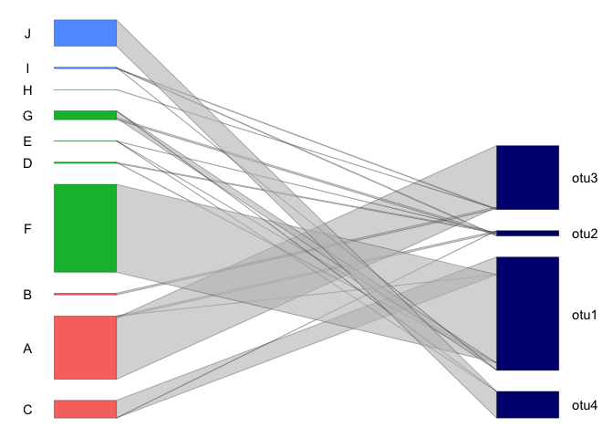
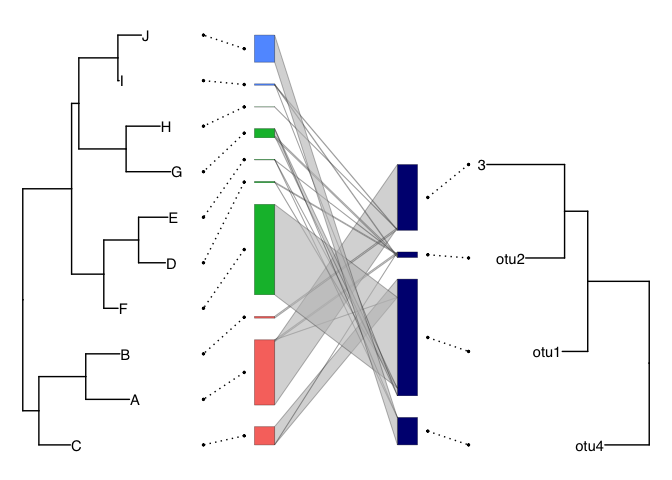
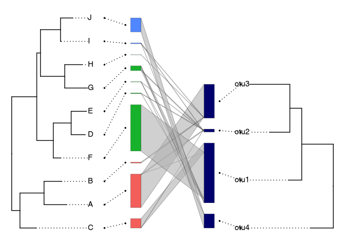
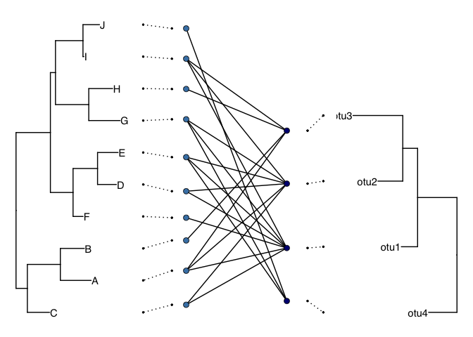
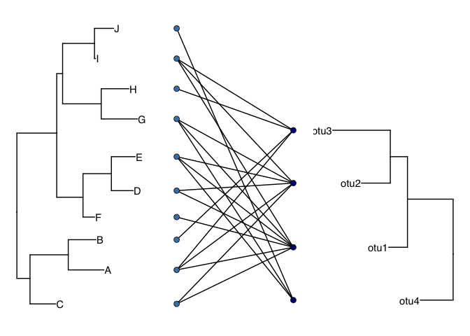
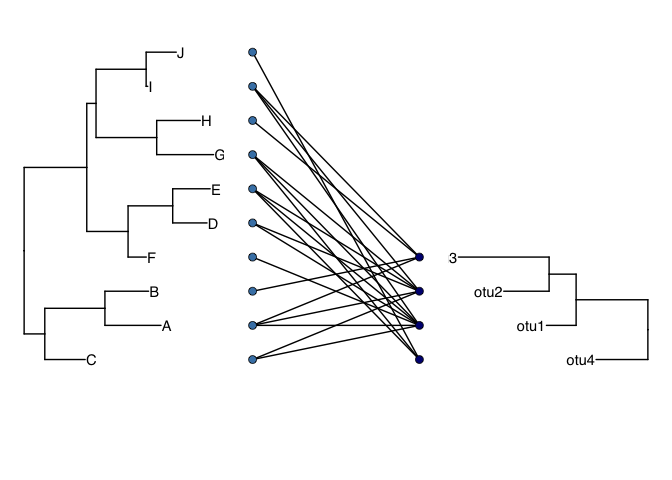

# README


## 1. ライブラリ読み込みと基本データ生成

最初に必要パッケージを読み込み、植物側・菌側の系統樹を作成します。
続いて、系統樹の tip 順に合わせて相互作用行列を並べ替え、 可視化に使う
long 形式データと `metadata_row` を準備します。 最後に abundance
表示の基本プロット `p` と、座標計算結果 `bn_coords` を作成します。

``` r
library(tidyverse)
library(ggtree)
library(marquee)
library(patchwork)
library(ggbipartite)

set.seed(123)
## host (plants) phylogeny.
host_phylo <- rtree(10)
host_phylo$tip.label <- LETTERS[1:10]
## symbiont (fungal) phylogeny.
symbiont_phylo <- rtree(4)
symbiont_phylo$tip.label <- sprintf("otu%d", 1:4)

host_order <- get_tip_order(host_phylo) |> rev()
symbiont_order <- get_tip_order(symbiont_phylo) |> rev()

interaction_matrix <- tibble(
  host = LETTERS[1:10],
  otu1 = c(1, 0, 100, 2, 1, 500, 40, 0, 1, 0),
  otu2 = c(10, 0, 1, 5, 1, 0, 10, 0, 4, 0),
  otu3 = c(350, 10, 0, 0, 0, 0, 0, 1, 3, 0),
  otu4 = c(0, 0, 0, 0, 1, 0, 1, 0, 0, 150)
) %>%
  arrange(factor(host, host_order)) |>
  relocate(host, all_of(symbiont_order)) |>
  column_to_rownames("host") %>%
  as.matrix()

interaction_df <- interaction_matrix %>%
  as_tibble(rownames = "host") %>%
  pivot_longer(
    cols = -host,
    names_to = "otu",
    values_to = "num_seq"
  ) %>%
  filter(num_seq > 0) %>%
  mutate(
    host = factor(host, host_order),
    otu = factor(otu, symbiont_order)
  )

metadata_row <- tibble(
  host = LETTERS[1:10],
  family = c("A", "A", "A", "B", "B", "B", "B", "B", "C", "C")
)

p <-
  ggplot(
    interaction_df,
    aes(row = host, column = otu, count = num_seq),
  ) +
  geom_bipnet_box(
    type = "box2",
    fill = "navy",
    linewidth = .1
  ) +
  geom_bipnet_interaction(
    type = "interaction",
    alpha = 0.6,
    show.legend = FALSE,
    linewidth = .1
  ) +
  geom_bipnet_box(
    aes(fill = after_stat(family)),
    type = "box1",
    row_nm = "host",
    metadata_row = metadata_row,
    show.legend = FALSE,
    linewidth = .1
  ) +
  theme_void()

# -------------------------------------------------------------------------

bn_coords <- construct_bn_coordination(
  .mat = interaction_matrix,
  .row = "host",
  .metadata_row = metadata_row,
  .gap = sum(interaction_matrix) / 10,
  .adjust_box_height = FALSE
)
```

## 2. 箱ラベル位置の算出と注釈表示

`bn_coords$box1` と `bn_coords$box2` からラベル用の代表座標を計算し、
`annotate()` で左右に host / otu ラベルを付与します。

``` r
# -------------------------------------------------------------------------

label_df_box1 <- bn_coords$box1 %>%
  pivot_longer(
    cols = c(xmin, xmax, ymin, ymax),
    names_to = c("axis", "end"),
    names_pattern = "([xy])(min|max)"
  ) %>%
  pivot_wider(
    names_from = axis,
    values_from = value
  ) %>%
  summarise(
    x = min(x),
    y = mean(y),
    .by = c(row, family)
  )

label_df_box2 <- bn_coords$box2 %>%
  pivot_longer(
    cols = c(xmin, xmax, ymin, ymax),
    names_to = c("axis", "end"),
    names_pattern = "([xy])(min|max)"
  ) %>%
  pivot_wider(
    names_from = axis,
    values_from = value
  ) %>%
  summarise(
    x = max(x),
    y = mean(y),
    .by = c(column)
  )

p +
  annotate(
    geom = "text",
    x = label_df_box1$x - 100,
    y = label_df_box1$y,
    label = label_df_box1$row
  ) +
  annotate(
    geom = "text",
    x = label_df_box2$x + 100,
    y = label_df_box2$y,
    label = label_df_box2$column
  ) +
  theme_void()
```



## 3. 系統樹とネットワークの統合（リンク線あり）

左右の系統樹を `adjust_tree()` で箱の高さに合わせ、 `create_link()`
で箱中心と tip をつなぐ点線リンクを生成します。
最後に、5パネル（tree-link-network-link-tree）を横並びで出力します。

``` r
# -------------------------------------------------------------------------

t1 <- adjust_tree(
  .phylo = host_phylo,
  .box = bn_coords$box1,
  .tree_position = "left",
  .adjust = 1
) +
  geom_tiplab()

t2 <- adjust_tree(
  .phylo = symbiont_phylo,
  .box = bn_coords$box2,
  .tree_position = "right",
  .adjust = 1
) +
  geom_tiplab(hjust = 1)

df_link1 <- create_link(
  box = bn_coords$box1,
  ggtree = t1,
  direction = "left",
  x = 1e+05 / 8,
  xend = 0
)

df_link2 <- create_link(
  box = bn_coords$box2,
  ggtree = t2,
  direction = "right",
  x = 0,
  xend = 1e+05 / 8
)

p_link1 <- ggplot() +
  geom_segment(
    data = df_link1,
    mapping = aes(x = x, y = y1, xend = xend, yend = y2, group = row),
    linetype = "dotted",
    linewidth = .5
  ) +
  geom_point(
    data = df_link1,
    mapping = aes(x, y1),
    size = 0.5
  ) +
  geom_point(
    data = df_link1,
    mapping = aes(xend, y2),
    size = 0.5
  ) +
  theme_void()

p_link2 <- ggplot() +
  geom_segment(
    data = df_link2,
    mapping = aes(x = x, y = y1, xend = xend, yend = y2, group = column),
    linetype = "dotted",
    linewidth = .5
  ) +
  geom_point(
    data = df_link2,
    mapping = aes(x, y1),
    size = 0.5
  ) +
  geom_point(
    data = df_link2,
    mapping = aes(xend, y2),
    size = 0.5
  ) +
  theme_void()

yr_t1 <- get_yrange(t1)
yr_t2 <- get_yrange(t2)

# Take the larger y-range (span) and apply it to both plots
ylim_common <- if (diff(yr_t1) >= diff(yr_t2)) yr_t1 else yr_t2

scale_y_common <- scale_y_continuous(
  limits = ylim_common,
  expand = expansion(mult = 0)
)

t1 <- t1 + scale_y_common
t2 <- t2 + scale_y_common
p_link1 <- p_link1 + scale_y_common
p_link2 <- p_link2 + scale_y_common

t1 +
  p_link1 +
  p +
  p_link2 +
  t2 +
  plot_layout(nrow = 1, widths = c(1, 0.25, 1, 0.25, 1))
```



## 4. `align = T` 版（tip ラベル整列描画）

`adjust_tree()` の結果に対して、内部ヘルパー由来の
ラベルセグメント・マーキー描画を加える版です。 先ほどと同じ 5
パネル構成で比較できます。

``` r
# `align = T` version.
t1 <- adjust_tree(
  .phylo = host_phylo,
  .box = bn_coords$box1,
  .tree_position = "left",
  .adjust = 1
)

t2 <- adjust_tree(
  .phylo = symbiont_phylo,
  .box = bn_coords$box2,
  .tree_position = "right",
  .adjust = 1
)

t1 <- t1 +
  geom_segment(
    data = function(df) .tiplab_segment_data(df, offset = 0),
    aes(x = x, xend = xend, y = y, yend = yend),
    linetype = "dotted",
    linewidth = 0.5,
    inherit.aes = FALSE
  ) +
  geom_marquee(
    data = function(df) .tiplab_marquee_data(df, offset = 0),
    aes(x = x_lab, y = y, label = label),
    hjust = 0,
    inherit.aes = FALSE
  ) +
  geom_nodelab(aes(label = label), hjust = 1, vjust = -1) +
  coord_cartesian(clip = "off")

t2 <- t2 +
  geom_segment(
    data = function(df) .tiplab_segment_data(df, offset = 0),
    aes(x = x, xend = xend, y = y, yend = yend),
    linetype = "dotted",
    linewidth = 0.5,
    inherit.aes = FALSE
  ) +
  geom_marquee(
    data = function(df) .tiplab_marquee_data(df, offset = 0),
    aes(x = x_lab, y = y, label = label),
    hjust = 1,
    inherit.aes = FALSE
  ) +
  geom_nodelab(aes(label = label), hjust = 1, vjust = -1) +
  coord_cartesian(clip = "off")

t1 <- t1 + scale_y_common
t2 <- t2 + scale_y_common
p_link1 <- p_link1 + scale_y_common
p_link2 <- p_link2 + scale_y_common

t1 +
  p_link1 +
  p +
  p_link2 +
  t2 +
  plot_layout(nrow = 1, widths = c(1, 0.25, 1, 0.25, 1))
```



## 5. binary モード（リンク線あり）

相互作用行列を 0/1 に変換し、`interaction_type = "binary"` を使って
二値相互作用を描画します。系統樹・リンク線の組み合わせは abundance
版と同様に維持します。

``` r
# binary ------------------------------------------------------------------

bmat <- (interaction_matrix != 0) * 1L

interaction_df <- bmat %>%
  as_tibble(rownames = "host") %>%
  pivot_longer(
    cols = -host,
    names_to = "otu",
    values_to = "num_seq"
  ) %>%
  filter(num_seq > 0) |>
  mutate(
    host = factor(host, host_order),
    otu = factor(otu, symbiont_order)
  )

bn_coords <- construct_bn_coordination(
  .mat = bmat,
  .row = "host",
  .metadata_row = metadata_row,
  .gap = sum(bmat) / 10
)

t1 <- adjust_tree(
  .phylo = host_phylo,
  .box = bn_coords$box1,
  .tree_position = "left",
  .adjust = 1
) +
  geom_tiplab()

t2 <- adjust_tree(
  .phylo = symbiont_phylo,
  .box = bn_coords$box2,
  .tree_position = "right",
  .adjust = 1
) +
  geom_tiplab(hjust = 1)

df_link1 <- create_link(
  box = bn_coords$box1,
  ggtree = t1,
  direction = "left",
  x = 1e+05 / 8,
  xend = 0
)

df_link2 <- create_link(
  box = bn_coords$box2,
  ggtree = t2,
  direction = "right",
  x = 0,
  xend = 1e+05 / 8
)

p_link1 <- ggplot() +
  geom_segment(
    data = df_link1,
    mapping = aes(x = x, y = y1, xend = xend, yend = y2, group = row),
    linetype = "dotted",
    linewidth = .5
  ) +
  geom_point(
    data = df_link1,
    mapping = aes(x, y1),
    size = 0.5
  ) +
  geom_point(
    data = df_link1,
    mapping = aes(xend, y2),
    size = 0.5
  ) +
  theme_void()

p_link2 <- ggplot() +
  geom_segment(
    data = df_link2,
    mapping = aes(x = x, y = y1, xend = xend, yend = y2, group = column),
    linetype = "dotted",
    linewidth = .5
  ) +
  geom_point(
    data = df_link2,
    mapping = aes(x, y1),
    size = 0.5
  ) +
  geom_point(
    data = df_link2,
    mapping = aes(xend, y2),
    size = 0.5
  ) +
  scale_x_continuous(expand = expansion(mult = 0.5)) +
  theme_void()

yr_t1 <- get_yrange(t1)
yr_t2 <- get_yrange(t2)

# Take the larger y-range (span) and apply it to both plots
ylim_common <- if (diff(yr_t1) >= diff(yr_t2)) yr_t1 else yr_t2

scale_y_common <- scale_y_continuous(
  limits = ylim_common,
  expand = expansion(mult = 0)
)

t1 <- t1 + scale_y_common
t2 <- t2 + scale_y_common
p_link1 <- p_link1 + scale_y_common
p_link2 <- p_link2 + scale_y_common

p_binary <- ggplot(
  interaction_df,
  aes(row = host, column = otu, count = num_seq)
) +
  geom_bipnet_interaction(
    type = "interaction",
    interaction_type = "binary",
    linewidth = .5,
    show.legend = FALSE
  ) +
  geom_bipnet_point(
    type = "box1",
    fill = "steelblue"
  ) +
  geom_bipnet_point(
    type = "box2",
    fill = "navy"
  ) +
  theme_void()

t1 +
  p_link1 +
  p_binary +
  p_link2 +
  t2 +
  plot_layout(nrow = 1, widths = c(1, 0.25, 1, 0.25, 1))
```



## 6. binary: 明示的リンク線なしの整列表示

`.adjust_tip_position = TRUE` を使い、リンク線を描かずに tree と binary
ノードを同じ y スケールで直接整列させます。

``` r
# binary without explicit link segments -----------------------------------

t1_binary_aligned <- adjust_tree(
  .phylo = host_phylo,
  .box = bn_coords$box1,
  .tree_position = "left",
  .adjust = 1,
  .adjust_tip_position = TRUE
) +
  geom_tiplab()

t2_binary_aligned <- adjust_tree(
  .phylo = symbiont_phylo,
  .box = bn_coords$box2,
  .tree_position = "right",
  .adjust = 1,
  .adjust_tip_position = TRUE
) +
  geom_tiplab(hjust = 1)

ylim_binary_aligned <- range(
  c(
    get_yrange(t1_binary_aligned),
    get_yrange(t2_binary_aligned),
    get_yrange(p_binary)
  ),
  na.rm = TRUE
)

scale_y_binary_aligned <- scale_y_continuous(
  limits = ylim_binary_aligned,
  expand = expansion(mult = 0)
)

t1_binary_aligned +
  scale_y_binary_aligned +
  p_binary +
  scale_y_binary_aligned +
  t2_binary_aligned +
  scale_y_binary_aligned +
  plot_layout(nrow = 1, widths = c(1, 1, 1))
```



## 7. binary: 系統樹スケールを保持した tip 対応表示

系統樹の tip 座標を `tip_positions_row` / `tip_positions_column`
に渡し、 binary ノード位置を tree スケールに厳密対応させる版です。

``` r
# binary with tree-scale preservation -------------------------------------

host_tip_positions <- ggtree::ggtree(host_phylo)$data |>
  dplyr::filter(!is.na(.data$isTip) & .data$isTip) |>
  dplyr::transmute(
    label = as.character(.data$label),
    y = as.numeric(.data$y)
  )

symbiont_tip_positions <- ggtree::ggtree(symbiont_phylo)$data |>
  dplyr::filter(!is.na(.data$isTip) & .data$isTip) |>
  dplyr::transmute(
    label = as.character(.data$label),
    y = as.numeric(.data$y)
  )

p_binary_tree_scale <- ggplot(
  interaction_df,
  aes(row = host, column = otu, count = num_seq)
) +
  geom_bipnet_interaction(
    type = "interaction",
    interaction_type = "binary",
    linewidth = .5,
    show.legend = FALSE,
    tip_positions_row = host_tip_positions,
    tip_positions_column = symbiont_tip_positions
  ) +
  geom_bipnet_point(
    type = "box1",
    fill = "steelblue",
    tip_positions_row = host_tip_positions,
    tip_positions_column = symbiont_tip_positions
  ) +
  geom_bipnet_point(
    type = "box2",
    fill = "navy",
    tip_positions_row = host_tip_positions,
    tip_positions_column = symbiont_tip_positions
  ) +
  theme_void()

t1_tree_scale <- ggtree::ggtree(host_phylo) +
  geom_tiplab()

t2_tree_scale <- ggtree::ggtree(symbiont_phylo) +
  geom_tiplab(hjust = 1) +
  scale_x_reverse()

ylim_tree_scale <- range(
  c(
    get_yrange(t1_tree_scale),
    get_yrange(t2_tree_scale),
    get_yrange(p_binary_tree_scale)
  ),
  na.rm = TRUE
)

scale_y_tree_scale <- scale_y_continuous(
  limits = ylim_tree_scale,
  expand = expansion(mult = 0)
)

t1_tree_scale +
  scale_y_tree_scale +
  p_binary_tree_scale +
  scale_y_tree_scale +
  t2_tree_scale +
  scale_y_tree_scale +
  plot_layout(nrow = 1, widths = c(1, 1, 1))
```


