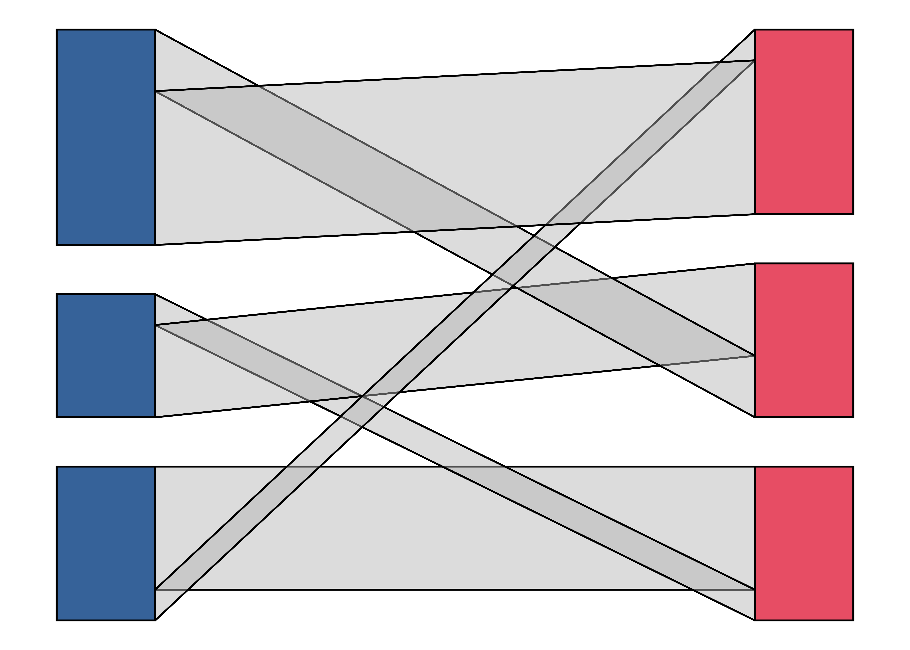
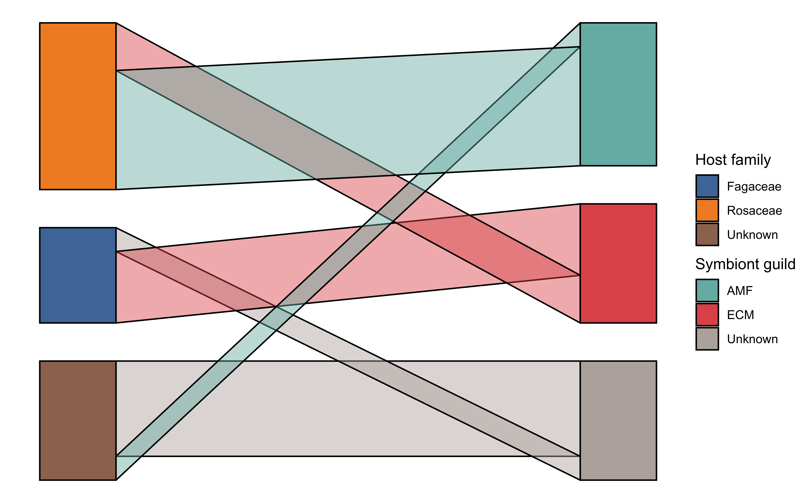
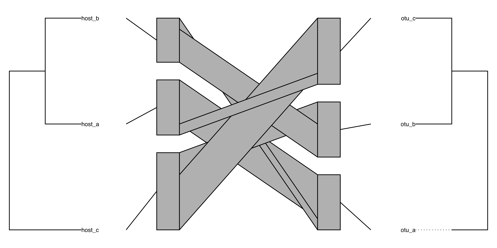

# ggbipartite


ggbipartite builds inspectable ggplot2 layouts for bipartite networks
and can align either partition with a phylogenetic tree. Abundance
ribbons and binary presence-absence segments use the same validated
input contract.

## Installation

Requires R 4.2.0 or later, ggplot2 3.4.0 or later, and ggtree 3.6.2 or
later. For R 4.2, use Bioconductor 3.16. R 4.1 is no longer supported.

Install the development version from GitHub:

``` r
pak::pak("Hide-Fun/ggbipartite")
```

## Quick start

Create a named interaction matrix, compute its layout once, and share
that layout across layers.

``` r
library(ggplot2)
library(ggbipartite)

interaction_matrix <- matrix(
  c(
    4, 0, 1,
    1, 3, 0,
    0, 2, 5
  ),
  nrow = 3,
  byrow = TRUE,
  dimnames = list(
    c("host_a", "host_b", "host_c"),
    c("otu_a", "otu_b", "otu_c")
  )
)

network_layout <- layout_bipartite(interaction_matrix)

ggplot() +
  geom_bipnet_box(
    layout = network_layout,
    type = "row",
    fill = "#4477AA"
  ) +
  geom_bipnet_box(
    layout = network_layout,
    type = "column",
    fill = "#EE6677"
  ) +
  geom_bipnet_interaction(
    layout = network_layout,
    alpha = 0.45
  ) +
  coord_fixed() +
  theme_void()
```



`network_layout$nodes` and `network_layout$interactions` contain the
exact data drawn by the layers. Long data is also supported when `row`,
`column`, and `weight` are named explicitly.

For a standard tree-link-network composition, supply trees while
creating the layout and call `plot_bipartite()`.

## Independent Metadata Legends

Row and column metadata often describe different biological concepts.
Keep their scales separate when the same category name could mean
different things on each side of the network.

``` r
row_metadata <- tibble::tibble(
  host = rownames(interaction_matrix),
  family = c("Unknown", "Fagaceae", "Rosaceae")
)
column_metadata <- tibble::tibble(
  otu = colnames(interaction_matrix),
  guild = c("Unknown", "ECM", "AMF")
)

metadata_layout <- layout_bipartite(
  interaction_matrix,
  metadata_row = row_metadata,
  metadata_column = column_metadata,
  metadata_row_key = "host",
  metadata_column_key = "otu"
)

family_palette <- c(
  "Unknown" = "#9C755F",
  "Fagaceae" = "#4E79A7",
  "Rosaceae" = "#F28E2B"
)
guild_palette <- c(
  "Unknown" = "#BAB0AC",
  "ECM" = "#E15759",
  "AMF" = "#76B7B2"
)

ggplot() +
  geom_bipnet_interaction(
    layout = metadata_layout,
    mapping = aes(fill = column_guild),
    alpha = 0.45,
    show.legend = FALSE
  ) +
  geom_bipnet_box(
    layout = metadata_layout,
    type = "column",
    mapping = aes(fill = column_guild)
  ) +
  scale_fill_manual(
    name = "Symbiont guild",
    values = guild_palette,
    guide = guide_legend(order = 2)
  ) +
  ggnewscale::new_scale_fill() +
  geom_bipnet_box(
    layout = metadata_layout,
    type = "row",
    mapping = aes(fill = row_family)
  ) +
  scale_fill_manual(
    name = "Host family",
    values = family_palette,
    guide = guide_legend(order = 1)
  ) +
  coord_fixed() +
  theme_void()
```



`ggnewscale::new_scale_fill()` starts a second fill scale. This is
different from merely changing guide order: the two `"Unknown"` levels
above are mapped independently because they belong to different metadata
variables.

## Abundance Networks With Trees

The same layout can carry abundance polygons, matched tree tips,
connector panels, styled tip labels, and internal-node support labels.
The rendering code for this publication-style composition is
intentionally hidden here; it is more verbose than the minimal API
example, but it shows the figure type that `ggbipartite` is designed to
make practical.



## Documentation

- `vignette("getting-started", package = "ggbipartite")` covers matrix
  and long inputs, abundance ribbons, binary segments, and shared
  layers.
- `vignette("tree-integration", package = "ggbipartite")` covers strict
  tree ID matching, connector panels, and direct binary tip alignment.
- `vignette("layout-contract", package = "ggbipartite")` defines the
  stable `bipartite_layout` schema.
- `vignette("migration-v0.10.0", package = "ggbipartite")` lists
  behavior changes and replacements for 0.9.x workflows.

The Japanese guides in `vignettes/*-ja.qmd` remain supplementary source
documents; the English API and vignettes are the primary reference.

## Development

Bug reports and focused reproducible examples are welcome in the [GitHub
issue tracker](https://github.com/Hide-Fun/ggbipartite/issues).
