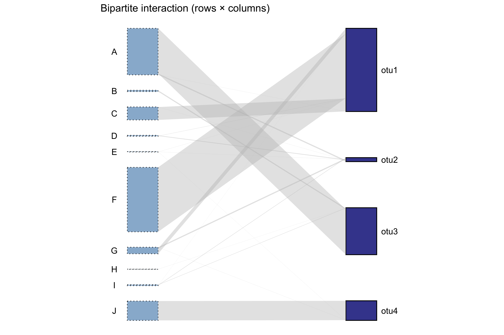
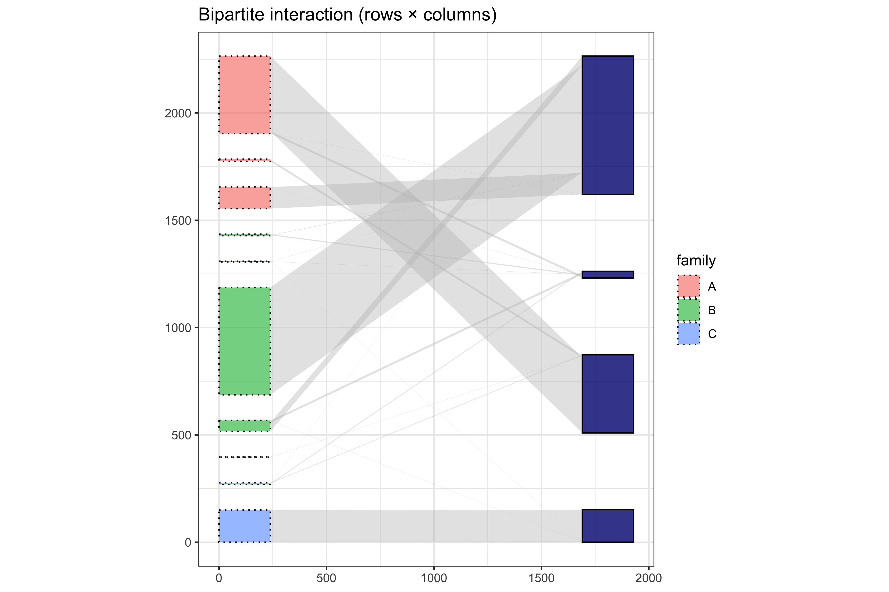
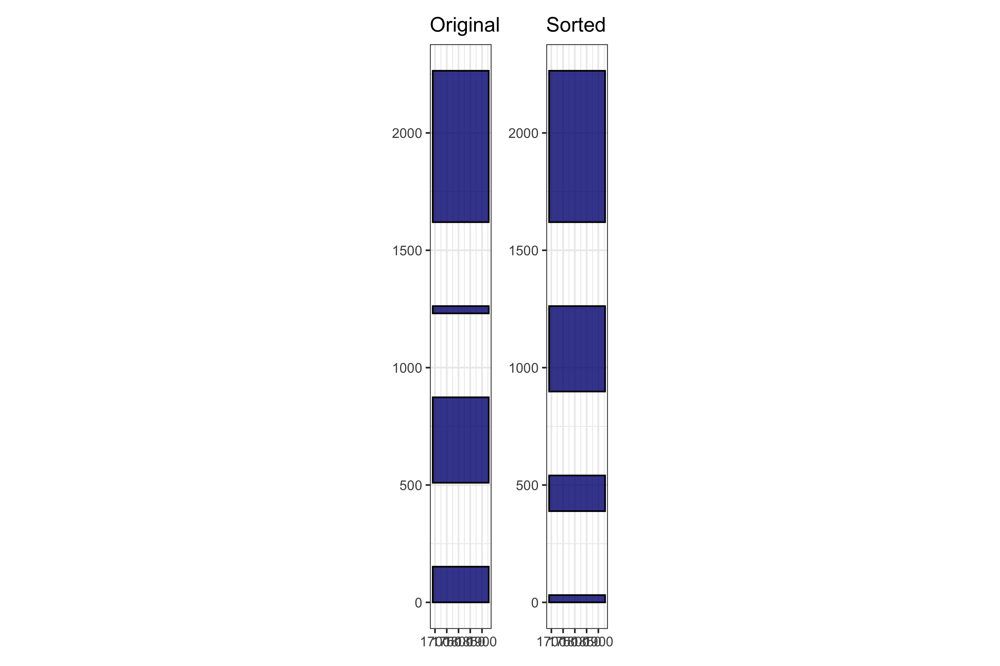

# README


## Purpose of ggbipartite package

- **(i) Matrix → data frame** conversion should be done *outside*
  geoms.  
  Prepare tidy data frames for each of the row sums, column sums, and
  interactions (row × column).
- **(ii) Data frame → visualization** should be done *inside* geoms.  
  Delegate position calculations and shape generation to geoms (and
  their helper functions).
- Defining the **relative positioning** between rows and columns (gaps,
  stacking order, etc.) is the key point.

This document shows the workflow of converting an `interaction_matrix`
into tidy format, building drawing coordinates via
`construct_bn_coordination()`, and visualizing with `geom_bipnet_*` (or
the companion `stat_bipnet()`).

## Prerequisites

- R (tidyverse)
- `construct_bn_coordination()`, `geom_bipnet_interaction()`, and
  `geom_bipnet_box()` are available (i.e., load *ggbipartite* or source
  files that provide these functions).

## Data preparation

> **Design policy**  
> Perform reshaping from the matrix *outside* geoms and prepare the
> values needed for drawing (row sums, column sums, interactions) in
> tidy form.  
> Visualization uses these data frames as **inputs**, and geoms compute
> coordinates and shapes.

``` r
library(tidyverse)
library(patchwork)
devtools::load_all(".")

# Example matrix --------------------------------------------------------------
interaction_matrix <- tibble(
  host = LETTERS[1:10],
  otu1 = c(1, 0, 100, 2, 1, 500, 40, 0, 1, 0),
  otu2 = c(10, 0, 1, 5, 1, 0, 10, 0, 4, 0),
  otu3 = c(350, 10, 0, 0, 0, 0, 0, 1, 3, 0),
  otu4 = c(0, 0, 0, 0, 1, 0, 1, 0, 0, 150)
) %>%
  as.data.frame() %>%
  column_to_rownames("host") %>%
  as.matrix()

# Row metadata ---------------------------------------------------------------
metadata_row <- tibble(
  host = LETTERS[1:10],
  family = c("A", "A", "A", "B", "B", "B", "B", "B", "C", "C")
)
```

### Tidy representation of interactions

``` r
# Convert matrix to tidy long format (row, column, weight).
interaction_df <-
  interaction_matrix %>%
  as_tibble(rownames = "host") %>%
  pivot_longer(
    cols = -host,
    names_to = "otu",
    values_to = "num_seq"
  ) %>%
  filter(num_seq > 0)

interaction_df
```

    # A tibble: 20 × 3
       host  otu   num_seq
       <chr> <chr>   <dbl>
     1 A     otu1        1
     2 A     otu2       10
     3 A     otu3      350
     4 B     otu3       10
     5 C     otu1      100
     6 C     otu2        1
     7 D     otu1        2
     8 D     otu2        5
     9 E     otu1        1
    10 E     otu2        1
    11 E     otu4        1
    12 F     otu1      500
    13 G     otu1       40
    14 G     otu2       10
    15 G     otu4        1
    16 H     otu3        1
    17 I     otu1        1
    18 I     otu2        4
    19 I     otu3        3
    20 J     otu4      150

## Coordinate generation: this is where relative positioning is defined

- `construct_bn_coordination()` returns coordinates to place interaction
  polygons and the two side boxes on a consistent coordinate system.
- Main arguments:
  - `.mat`: the original matrix (scale reference)
  - `.metadata_row`: grouping on the row side (e.g., family)
  - `.gap`: parameters controlling relative positioning such as group
    spacing

> **Key point**  
> Allocate lengths on both row and column sides based on the “weights”
> (row sums and column sums), and secure whitespace between groups with
> `.gap`.  
> Each data frame returned by this function (`interaction_coords`,
> `box1`, `box2`) already contains **drawable coordinate columns**
> (e.g., `x`, `y`, `xmin`, `xmax`, `ymin`, `ymax`).

``` r
# Build drawing coordinates from the matrix and metadata.
bn_coords <- construct_bn_coordination(
  .mat = interaction_matrix,
  .metadata_row = metadata_row,
  .row = "host",
  .gap = 100
)

# For reference only: expected columns (may vary by implementation)
# - bn_coords$interaction_coords: x, y, row, column, family, ...
# - bn_coords$box1: xmin, xmax, ymin, ymax, row, family, ...
# - bn_coords$box2: xmin, xmax, ymin, ymax, column, ...
```

Even though the geoms below compute coordinates internally through
`stat_bipnet()`, pre-computing them with `construct_bn_coordination()`
is useful when you need to inspect, tweak, or reuse the positioning
logic outside of a plot.

## Visualization: drawing with geoms

> **Design policy**  
> From here on, finish visualization *inside* geoms.  
> Because `construct_bn_coordination()` has already computed positions,
> you only need to bind columns via `mapping`.

``` r
p <- ggplot(
  interaction_df,
  aes(row = host, column = otu, count = num_seq)
) +
  # Draw row-side boxes (hosts) with metadata-driven fill.
  geom_bipnet_box(
    type = "box1",
    alpha = 0.6,
    fill = "steelblue",
    linewidth = 0.4,
    linetype = "dotted"
  ) +
  # Draw column-side boxes (OTUs).
  geom_bipnet_box(
    type = "box2",
    alpha = 0.8,
    fill = "navy"
  ) +
  # Draw interaction polygons linking rows and columns.
  geom_bipnet_interaction(
    type = "interaction",
    alpha = 0.4,
    show.legend = FALSE,
    colour = NA
  ) +
  coord_equal() +
  labs(
    title = "Bipartite interaction (rows × columns)"
  ) +
  theme_bw()

p
```


### Add labels

The coordinates can be obtained with construct_bn_coordination(), so
I’ll use that for adding labels.

``` r
bn_coords <- construct_bn_coordination(
  .mat = interaction_matrix,
  .row = "host",
  .metadata_row = metadata_row,
  .gap = sum(interaction_matrix)/10
)

label_df_box1 <- bn_coords$box1 %>% 
  pivot_longer(
    cols = c(xmin, xmax, ymin, ymax),
    names_to = c("axis", "end"),
    names_pattern = "([xy])(min|max)"
  ) %>% 
  pivot_wider(
    names_from = axis,
    values_from = value
  ) %>%
  summarise(
    x = min(x), y = mean(y),
    .by = c(row, family)
  )

label_df_box2 <- bn_coords$box2 %>% 
  pivot_longer(
    cols = c(xmin, xmax, ymin, ymax),
    names_to = c("axis", "end"),
    names_pattern = "([xy])(min|max)"
  ) %>% 
  pivot_wider(
    names_from = axis,
    values_from = value
  ) %>%
  summarise(
    x = max(x), y = mean(y),
    .by = c(column)
  )

p + annotate(
  geom = "text",
  x = label_df_box1$x - 100,
  y = label_df_box1$y,
  label = label_df_box1$row
) +
  annotate(
  geom = "text",
  x = label_df_box2$x + 100,
  y = label_df_box2$y,
  label = label_df_box2$column
) +
  theme_void()
```



### Incorporate matadata.

If you want to add metadata corresponding to rows or columns, you can
use　the `row` and  `metadat_row` , `column`
and `metadat_column` arguments. Internally, a metadata data-frame is
attached during the computation stage in `stat_bipnet()`, so you can
access it using `after_stat()`.

``` r
p <- 
ggplot(
  interaction_df,
  aes(row = host, column = otu, count = num_seq),
  linewidth = .1
) +
  geom_bipnet_box(
    type = "box2",
    alpha = 0.8,
    fill = "navy"
  ) +
  geom_bipnet_interaction(
    type = "interaction",
    alpha = 0.4,
    show.legend = FALSE,
    colour = NA
  ) +
  coord_equal() +
  labs(
    title = "Bipartite interaction (rows × columns)"
  ) +
  theme_bw()

# metadata_row は群集行列の行名に対応するメタデータ
metadata_row
```

    # A tibble: 10 × 2
       host  family
       <chr> <chr> 
     1 A     A     
     2 B     A     
     3 C     A     
     4 D     B     
     5 E     B     
     6 F     B     
     7 G     B     
     8 H     B     
     9 I     C     
    10 J     C     

``` r
p + geom_bipnet_box(
    aes(fill= after_stat(family)),
    type = "box1",
    alpha = 0.6,
    row_nm = "host",
    metadata_row = metadata_row,
    linetype = "dotted"
  )
```



``` r
# sort.
interaction_df2 <- interaction_df %>% 
  mutate(
    host = factor(host, levels = c("A", "C", "B", "D", "E", "F", "G", "H", "I", "J")),
    otu = factor(otu, levels = c("otu1", "otu3", "otu4", "otu2"))
  )

p1 <- ggplot(
  interaction_df,
  aes(row = host, column = otu, count = num_seq),
  linewidth = .1
) +
  geom_bipnet_box(
    type = "box2",
    alpha = 0.8,
    fill = "navy"
  ) +
  coord_equal() +
  labs(
    title = "Original"
  ) +
  theme_bw()

p2 <- ggplot(
  interaction_df2,
  aes(row = host, column = otu, count = num_seq),
  linewidth = .1
) +
  geom_bipnet_box(
    type = "box2",
    alpha = 0.8,
    fill = "navy"
  ) +
  coord_equal() +
  labs(
    title = "Sorted"
  ) +
  theme_bw()

p1 + p2
```



## Summary

- **Outside (preprocessing)**: keep community data matrix reshaping, row
  totals, and column totals in tidy data frames (`interaction_df`,
  `row_sum_df`, `col_sum_df`).
- **Inside (drawing)**: let `geom_bipnet_*` (or `stat_bipnet()`) handle
  coordinate construction while you focus on aesthetics.
